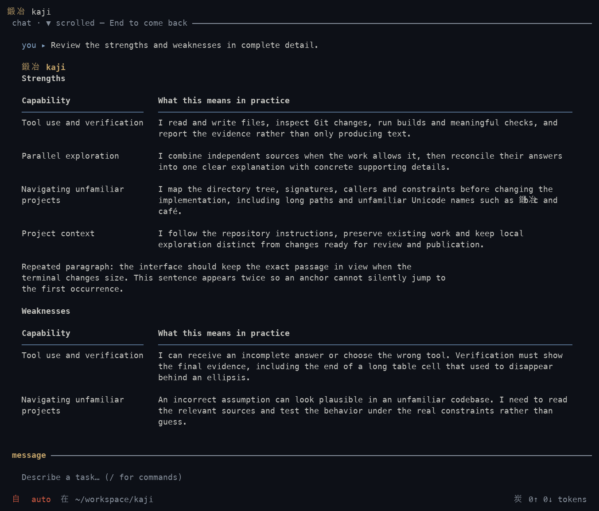
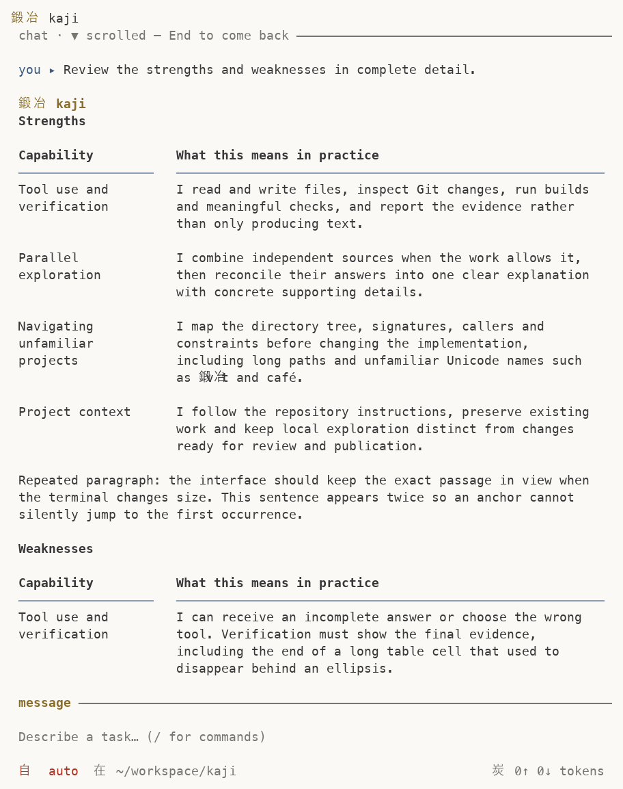

# Responsive terminal reading validation — 2026-10-09

The user rejected the prior transcript's visual readability. This lot preserves
complete table cells and makes the terminal width useful, while keeping ordinary
prose at a readable measure. It follows security commit `79985e6b9`.
Astra/root reviewed the clean renders; user visual acceptance remains pending.
Exact published-source tests and strict clippy pass. The recipe was
intentionally interrupted after an environment error and has not passed.

## Resulting behavior

Tables preserve complete cells and inline styles without ellipsis. Prose cells
use at most 96 columns and labels at most 28; ordinary prose wraps at 88, while
code uses the available width. At 40 columns, a two-column table presents its
schema once, then the first value as a small heading and the second as its body.
Wider schemas retain their labels. Adaptive margins align role, prose, tables
and composer at 200 columns. User queries use neutral body text. The agent role
names kaji next to its kanji. Headings use quiet bold text.

The compact composer remains a single line with horizontal caret scrolling;
it does not grow with the text. Resize anchors use message, source line, cell
and scalar offset. Header-to-record transitions, including wider and header-only
schemas, preserve source identity. Scroll gestures synchronize the effective
position after resize. Source/width/theme cache identity and retained-byte
accounting include the source maps; streaming cursor rows remain consistent.

## Validation

The full working-tree TUI gate passes **868 tests, zero failures, three ignored**
(299 filtered out, 4.15 s). It includes 11 preexisting local forge tests that are
excluded from publication. The exact published CLI library suite passes **1,155 tests, zero failures,
four ignored** in 4.35 s, after the snapshot CLI recompiled in 17.63 s. The three
known unrelated forge test names are absent from its output. The full working
CLI count would include 11 earlier forge tests; it was not rerun as a separate
whole-suite gate. These counts must not be substituted for one another. Ignored TUI checks write
review artifacts or manually measure render timing; their artifacts/measurements
were collected separately. A streaming-buffer timing test is also ignored by
the whole CLI suite.

Working-tree strict CLI all-target clippy passes in 1m10s; lean debug build passes
in 12.83s. Exact published-source all-target CLI clippy passes in 7.33 s. Hermit/Rust 1.96.1, locked/offline,
four jobs, incremental and compiler wrapper disabled; lean features
`tui,rustls-tls,system-keyring,update`. The debug binary is
`/tmp/kaji-ux-validation-2026-10-09/debug/kaji`, SHA-256
`d41df09fb05a6b3e4d94423cb4a795261060883af61ceb8d15625e403d542b79`.
It includes earlier local CLI edits; no installed binary was replaced.

Real terminal evidence uses a synthetic localhost provider in the state-machine
engine. Follow-bottom is checked at 80/120/200/40/200 columns. While scrolled,
SECOND_NAV_RECORD stays visible through 80→40→200→40→120→80. The real terminal
check was not repeated with the legacy engine. Unit buffer checks cover complete
cell sentinels, styles, grapheme/cell widths and cached/fresh equality. Twelve
clean captures cover zen/light/gruvbox at 40/80/120/200; Astra/root reviewed
representative captures, including zen40/120/200, light80 and gruvbox120. This is agent review, not user
acceptance. The user capture dated 19:46:07 reopened visual acceptance; prior
functional checks remain evidence only of their own scope. The earlier 63%
figure meant 26/41 historical P4 checkboxes, including historical/duplicate items,
not global effort or visual acceptance.

The updated recipe includes responsive reading checks. The provider responded
this time: initial phase 1 read/edit/restore operations and shell isolation were
observed. Its tool-triggered compilation encountered `sccache Operation not
permitted`, then retried through Rustup outside the approved validation context.
The maintainer stopped the run and its Cargo child with SIGINT to avoid that
inappropriate compilation. The process closed with exit 0, but the recipe was
**intentionally interrupted and has not passed**. This attempt is not the earlier
HTTP 410 result, and its process exit code is not evidence of recipe completion.

## Debug performance and memory tradeoff

With the original 32-entry / 128 KiB cache, initial 32-answer warm frames measured
3.78/6.17 ms at 40/200 columns and 128-answer frames 41.92/58.64 ms. Repeated cache
misses motivated a bounded 256-entry / 1 MiB cache. The retained payload ceiling
increases by **896 KiB**; map metadata is separately bounded by entry count and
oversize answers are not retained. Virtualization remains outside scope.

Final-source debug measurements: 32-answer warm frames **3.744/6.061 ms** at
40/200 columns; 128-answer frames **14.432/23.717 ms**, with 2,560 hits and zero
misses, retaining 363,172/341,156 payload bytes. A 64 KiB cell costs
30.484/31.179 ms cold and **19.494/21.192 ms** warm, with 20 hits and zero misses,
retaining 380,146/263,917 bytes. These are controlled debug measurements, not
optimized runtime, total RSS, global smoothness or competitor evidence. This is
a CPU/RAM tradeoff, not a claim of reduced total RAM.

## Publication boundaries and limits

Publication is extracted from baseline→final UX changes against HEAD; app/ui/mod
preexisting forge changes remain outside the index. No provider, replay or OS
security behavior changes here. No native international-platform validation,
main merge or installed-binary replacement is claimed. Current publication state is recorded in the repository and canonical roadmaps. [Metrics and terminal results](2026-10-09-responsive-reading-results.json).

