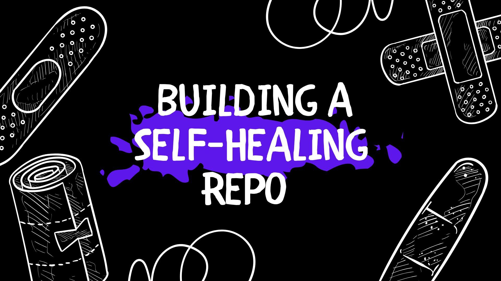

As AI agents grow in capability, more people feel empowered to code and contribute to open source. The ceiling feels higher than ever. That is a net positive for the ecosystem, but it also changes the day-to-day reality for maintainers. Maintainers like the [kaji](/) team face a growing volume of pull requests and issues, often faster than they can realistically process.

We embraced this reality and put kaji to work on its own backlog.

<!--truncate-->

We actually used kaji pre-1.0 to help us build kaji 1.0. The original kaji was a Python CLI, but we needed to move quickly to Rust, Electron, and an [MCP-native](https://modelcontextprotocol.io) architecture. kaji helped us make that transition. Using it to triage issues and review changes felt like a natural extension, so we embedded kaji directly into a [GitHub Action](https://github.com/aaif-goose/goose/blob/main/.github/workflows/goose-issue-solver.yml).

:::note Credit
That GitHub Action workflow was built by [Tyler Longwell](https://github.com/tlongwell-block), who took an idea we had been exploring manually and turned it into something any maintainer could trigger with a single comment.
:::

## Before the GitHub Action

Before the GitHub Action existed, the kaji team was already using kaji to accelerate our issue workflow. Here's a real example.

A user reached out on Discord asking why an Ollama model was throwing an error in chat mode. Rather than digging through the codebase myself, I asked kaji to explore the code, identify the root cause, and explain it back to me. Then, I asked kaji to use the GitHub CLI to open an [issue](https://github.com/aaif-goose/goose/issues/6117).

During that same session, kaji mentioned it had 95% confidence it knew how to fix the problem. The change was small, so I asked kaji to open a [PR](https://github.com/aaif-goose/goose/pull/6118). It was merged the same day.

This kind of workflow has changed how I operate as a Developer Advocate. Before kaji, when a user reported a problem, the process unfolded in fragments. I would ask clarifying questions, check GitHub for related issues, pull the latest code, grep through files, read the logic, and try to form a hypothesis about what was going wrong.

If I figured it out, I had two options:
1. I could write up a detailed issue and add it to a developer's backlog, which meant someone else had to context-switch into the problem later. 
2. Or I could attempt the fix myself, which often led to more time spent and more back-and-forth during code review if I got something wrong. 

Either way, the process stretched across hours or days. And if the problem wasn't high priority, it sometimes slipped through the cracks. The report would sit in Discord or a GitHub comment until it scrolled out of view, and the user would assume nobody was listening.

With kaji, that entire process collapsed into a single conversation. 

The local workflow works. But when I solve an issue locally with kaji, I'm still the one driving. I stop what I'm doing, open a session, paste the issue context, guide kaji through the fix, run the tests, and open the PR.

## Scaling with a GitHub Action

The GitHub Action compresses that entire sequence into a single comment. A team member sees an issue, comments `/kaji`, and moves on. kaji spins up in a container, reads the issue, explores the codebase, runs verification, and opens a draft PR. The maintainer returns to a proposed solution rather than a blank slate.

We saw this play out with [issue #6066](https://github.com/aaif-goose/goose/issues/6066). Users reported that kaji kept defaulting to 2024 even though the correct datetime was in the context. The issue sat for two days. Then Tyler saw it, commented `/kaji solve this minimally` at 1:59 AM, and went back to whatever he was doing (presumably sleeping). Fourteen minutes later, kaji opened [PR #6101](https://github.com/aaif-goose/goose/pull/6101).

The maintainer's role shifts from implementing to reviewing. The bottleneck in open source is rarely "can someone write this code." It's "can someone with enough context find the time to write this code." The GitHub Action decouples those two constraints. Any maintainer can trigger a fix attempt without deep familiarity with that part of the codebase.

This scales in a way manual triage cannot. A backlog contains feature requests, complex bugs, and quick fixes in equal measure. The Action lets you point at an issue and say "try this one" without committing your afternoon. If kaji fails, you lose minutes of compute. If it succeeds, you save hours.

For contributors, responsiveness changes everything. When a user filed [issue #6232](https://github.com/aaif-goose/goose/issues/6232) about slash commands not handling optional parameters, a maintainer quickly commented `/kaji can you fix this`, and within the hour there was a draft PR with the fix and four new tests. Even if the PR is not perfect and needs adjustments, contributors see momentum.

## Under the Hood

Maintainers summon kaji with `/kaji` followed by a prompt as a comment on an issue. GitHub Actions spins up a container with kaji installed, passes in the issue metadata, and lets kaji work. If kaji produces changes and verification passes, the workflow opens a **draft** pull request.

But there's more happening under the hood than a simple prompt like "/kaji fix this."

The workflow uses a [recipe](https://github.com/aaif-goose/goose/blob/main/.github/workflows/goose-issue-solver.yml#L14-L78) that defines phases to ensure kaji actually accomplishes the job and doesn't do more than we ask it to.

| Phase      | What kaji does                                       | Why it matters                                                        |
| ---------- | ----------------------------------------------------- | --------------------------------------------------------------------- |
| Understand | Read the issue and extract all requirements to a file | Forces the AI to identify what "done" looks like before writing code  |
| Research   | Explore the codebase with search and analysis tools   | Prevents blind edits to unfamiliar code                               |
| Plan       | Decide on an approach                                 | Catches architectural mistakes before implementation                  |
| Implement  | Make minimal changes per the requirements             | "Is this in the requirements? If not, don't add it"                   |
| Verify     | Run tests and linters                                 | Catches obvious failures before a human sees the PR                   |
| Confirm    | Reread the original issue and requirements            | Prevents the AI from declaring victory while forgetting half the task |

The [recipe](https://github.com/aaif-goose/goose/blob/main/.github/workflows/goose-issue-solver.yml) also gives kaji access to the [TODO extension](/docs/mcp/todo-mcp), a built-in tool that acts as external memory. The phases tell kaji *what* to do. The TODO helps kaji *remember* what it's doing. As kaji reads through the codebase and builds a solution, its context window fills up and earlier instructions can be compressed or lost. The TODO persists, so kaji can always check what it's done and what's left.

The workflow also enforces guardrails around who can invoke `/kaji`, which files it's allowed to touch, and the requirement that a maintainer review and approve every PR.

There's something strange about using kaji to maintain kaji. But it keeps us honest. We're our own first customer, and if the agent can't produce mergeable PRs here, we feel it immediately.

The future we're aiming for isn't one where AI replaces maintainers. It's one where a maintainer can point at a problem, say "try this," and come back to a concrete proposal instead of a blank editor.

If that becomes the norm, open source scales differently.

The [GitHub Action workflow](https://github.com/aaif-goose/goose/blob/main/.github/workflows/goose-issue-solver.yml) is public for anyone who wants to explore this pattern in their own CI pipeline.  

<head>
  <meta property="og:title" content="How We Use kaji to Maintain kaji" />
  <meta property="og:type" content="article" />
  <meta property="og:url" content="https://goose-docs.ai/blog/2025/12/28/goose-maintains-goose" />
  <meta property="og:description" content="Learn how an AI agent embedded in GitHub Actions helps maintainers triage issues and keep open source moving." />
  <meta property="og:image" content="https://goose-docs.ai/assets/images/goose-maintains-goose-4b25a92b0dfd9a6acce8c8f8e9c954f7.png" />
  <meta name="twitter:card" content="summary_large_image" />
  <meta property="twitter:domain" content="kaji-docs.ai" />
  <meta name="twitter:title" content="How We Use kaji to Maintain kaji" />
  <meta name="twitter:description" content="Learn how an AI agent embedded in GitHub Actions helps maintainers triage issues and keep open source moving." />
  <meta name="twitter:image" content="https://goose-docs.ai/assets/images/goose-maintains-goose-4b25a92b0dfd9a6acce8c8f8e9c954f7.png" />
</head>
